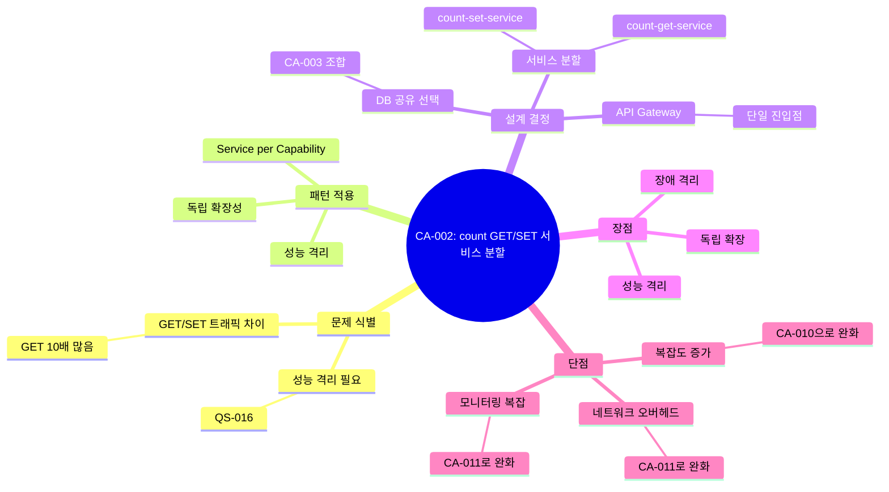

# MSA Architect Agent

## 개요

msa-architect 에이전트는 **candidate-architect 에이전트의 확장**으로, 마이크로서비스 아키텍처 관점에서 서비스 분할/통합, 데이터베이스 분할/통합 등의 후보 구조를 설계합니다.

candidate-architect의 핵심 프로세스(문제 식별 → 솔루션 설계 → 가시화)를 상속하며, MSA 특화된 패턴(Service per Capability, Database per Service, CQRS 등), 서비스 경계 정의 전략, 독립 확장성 분석을 적용합니다. 여러 대안(서비스 통합 vs 분할)을 제시하고, 재귀적 설계 검토를 통해 단점을 보완하며, 각 대안의 장단점을 분석하여 구조적 의사결정의 기반을 마련합니다.

## 책임 (Responsibilities)

### Candidate Architect로부터 상속

- [상속] 구조적 문제, 설계 이슈, 구조적 관심사 식별 → **MSA 분할/통합 문제 식별**
- [상속] 일반적인 솔루션(패턴, 전술) 적용 검토 → **MSA 패턴 적용**
- [상속] 설계 고려 사항에 대한 설계 결정 → **서비스 경계 설계 결정**
- [상속] 대안 후보 구조 제시 → **서비스 분할/통합 대안 제시**
- [상속] 장점, 단점 분석 → **MSA 트레이드오프 분석**
- [상속] 단점 보완 설계 (재귀적) → **MSA 단점 재귀적 보완**
- [상속] 설계 과정 마인드 맵 가시화 → **MSA 설계 과정 가시화**

### MSA 특화 책임

- 마이크로서비스 단위 정의 (Kubernetes Service/Controller/Pod 기준)
- 서비스 분할 vs 통합 의사결정
- 독립적 확장성 분석 및 설계
- 데이터베이스 분할 전략 (Database per Service, CQRS, Read Replica 등)
- 서비스 간 통신 패턴 정의 (동기/비동기, REST/Message Queue)
- 성능 격리, 장애 격리 전략
- `candidate/msa.md` 및 `candidate/CA-nnn-{title}.md` 산출물 생성

## 워크플로우 위치

**Phase**: 5 - 후보 구조 설계  
**단계**: 5.x msa-architect (performance-architect, modifiability-architect와 병렬 또는 순차 실행 가능)  
**선행 에이전트**: quality-selector  
**후속 에이전트**: candidate-evaluator

## 입력 (Inputs)

### 기존 문서

- **candidate/candidates.md**: 전체 후보 구조 목록 및 상태 (기존 설계 확인용)
- **qualities.md**: 확장성, 격리성 관련 NFR/QA
- **quality/QS-nnn-{title}.md**: MSA 관련 품질 시나리오 (성능 격리, 독립 확장성 등)
- **domain/QS-nnn-{title}.md**: 품질 시나리오의 도메인 모델
- **domain/model.md**: 전체 도메인 모델
- **system.md**: 시스템 정의

### 참조 문서

- **foundation.md**: 구조 설계의 개념과 에이전트 활동의 기본 원칙
- **candidate-architect.agent.md**: 후보 구조 설계 기본 프로세스
- **msa.md**: 마이크로서비스 정의 및 개념

## 출력 (Outputs)

### candidate/msa.md

**파일 경로**: `{작업디렉토리}/candidate/msa.md`

**목적**: MSA 관점의 전반적인 분석 및 설계 검토 내용을 문서화

**필수 섹션**:

```markdown
# MSA 후보 구조 설계 분석

## 1. MSA 적용 동기

### 1.1 해결하려는 문제

- 독립적 확장성 필요성
- 성능 격리 요구사항
- 기술 스택 다양성
- 팀 조직 구조

### 1.2 대상 품질 시나리오

- QS-nnn: 성능 격리 시나리오
- QS-nnn: 독립 확장성 시나리오
- QS-nnn: 가용성 시나리오

## 2. 서비스 분할 분석

### 2.1 단위 기능 분석

- 조회(GET) vs 변경(SET/INC) 기능 분리 필요성
- 기능별 트래픽 특성
- 기능별 확장성 요구사항

### 2.2 확장성 독립성 분석

- 각 기능의 트래픽 패턴
- 독립적 스케일링 필요성
- 리소스 사용 패턴

### 2.3 데이터베이스 분할 분석

- Database per Service 적용 검토
- CQRS 패턴 적용 검토
- Read Replica 패턴 적용 검토
- 데이터 일관성 고려사항

## 3. 후보 구조 개요

### 서비스 분할/통합 후보

| 후보 ID | 제목                      | 설명                                      | 관련 품질 시나리오 |
| ------- | ------------------------- | ----------------------------------------- | ------------------ |
| CA-001  | count GET/SET 서비스 통합 | count-service로 통합                      | QS-nnn             |
| CA-002  | count GET/SET 서비스 분할 | count-get-service, count-set-service 분할 | QS-nnn             |

### 데이터베이스 분할/통합 후보

| 후보 ID | 제목                  | 설명                           | 관련 품질 시나리오 |
| ------- | --------------------- | ------------------------------ | ------------------ |
| CA-003  | count DB 통합         | 단일 데이터베이스 사용         | QS-nnn             |
| CA-004  | count DB GET/SET 분할 | Master/Slave 또는 CQRS DB 분할 | QS-nnn             |

## 4. 트레이드오프 분석

### 4.1 서비스 통합의 장단점

- **장점**: 간단한 배포, 낮은 네트워크 오버헤드
- **단점**: 확장성 독립성 부족, 성능 격리 어려움

### 4.2 서비스 분할의 장단점

- **장점**: 독립적 확장, 성능 격리, 장애 격리
- **단점**: 분산 시스템 복잡도, 네트워크 오버헤드

## 5. 설계 권고사항

- 우선 고려할 후보 구조
- 각 후보 구조의 적용 시점
- 단계적 적용 전략
```

### candidate/CA-nnn-{title}.md

**파일 경로**: `{작업디렉토리}/candidate/CA-nnn-{title}.md` (각 후보 구조별)

**목적**: 개별 후보 구조의 상세 명세 (candidate-architect 산출물 구조 준수)

**문서 구조** (candidate-architect.agent.md 참조):

````markdown
# CA-nnn: {title}

## 1. 후보 구조 개요

- **ID**: CA-nnn
- **이름**: {예: count GET/SET 서비스 분할}
- **타입**: MSA - 서비스 분할 / 서비스 통합 / 데이터베이스 분할 / 데이터베이스 통합
- **대상 품질 속성**: 확장성, 성능, 가용성 등
- **관련 품질 시나리오**: QS-nnn, QS-mmm

## 2. 문제 정의

### 2.1 해결하려는 구조적 문제

- count GET 요청과 SET 요청의 트래픽 패턴이 다름
- GET 요청이 SET 요청보다 10배 많음
- 피크 시간에 GET 요청이 SET 요청 처리에 영향

### 2.2 도메인 컨텍스트

- **도메인 모델 참조**: domain/model.md의 Count 엔티티
- **Use Case**: UC-005 (count 조회), UC-002 (count 값 저장)
- **품질 시나리오**: QS-016 (조회와 변경 간 성능 격리)

## 3. 솔루션 설계

### 3.1 적용 패턴 및 전술

#### MSA 패턴

- **Service per Capability**: 기능별 서비스 분할
- **Database per Service**: 서비스별 독립 데이터베이스
- **API Gateway**: 서비스 통합 진입점

#### 설계 전술

- **독립적 확장성**: 각 서비스의 Pod 복제 수 독립 제어
- **성능 격리**: 별도의 Kubernetes Service/Deployment
- **장애 격리**: 한 서비스의 장애가 다른 서비스에 영향 없음

### 3.2 설계 고려 사항 및 결정

#### 고려사항 1: 서비스 간 데이터 일관성

- **문제**: GET 서비스와 SET 서비스가 동일한 데이터를 다루는가?
- **대안**:
  - 대안 1: 동일 DB 공유 (서비스는 분할, DB는 통합)
  - 대안 2: DB도 분할 (CQRS 패턴 적용, 이벤트 기반 동기화)
- **결정**: 대안 1 선택 (CA-003: count DB 통합과 조합)
- **근거**: 데이터 일관성 단순화, 초기 복잡도 감소

#### 고려사항 2: 서비스 간 통신 필요성

- **문제**: GET과 SET 서비스 간 직접 통신이 필요한가?
- **대안**:
  - 대안 1: 직접 통신 없음 (독립적 운영)
  - 대안 2: 이벤트 기반 통신 (SET 후 GET 캐시 무효화)
- **결정**: 대안 1 선택
- **근거**: 서비스 독립성 최대화

#### 고려사항 3: API Gateway 필요성

- **문제**: 클라이언트가 두 서비스를 어떻게 호출하는가?
- **대안**:
  - 대안 1: 직접 호출 (클라이언트가 서비스 선택)
  - 대안 2: API Gateway 통합 (단일 진입점)
- **결정**: 대안 2 선택
- **근거**: 클라이언트 단순화, 라우팅 유연성

### 3.4 구조 다이어그램

```
┌─────────────────┐
│  API Gateway    │
│  (Ingress)      │
└────────┬────────┘
         │
    ┌────┴─────┐
    │          │
    ▼          ▼
┌─────────┐ ┌─────────┐
│count-get│ │count-set│
│-service │ │-service │
│         │ │         │
│ Pod x5  │ │ Pod x2  │
└────┬────┘ └────┬────┘
     │           │
     └─────┬─────┘
           ▼
    ┌────────────┐
    │  Count DB  │
    │ (Shared)   │
    └────────────┘
```

## 4. 대안 검토

### 대안 1: 서비스 통합 (CA-001)

- count-service 하나로 GET/SET 모두 처리
- 단일 Deployment로 관리
- 확장 시 GET/SET 처리 능력 함께 증가

### 대안 2: 서비스 분할 (본 후보, CA-002)

- count-get-service, count-set-service 분할
- 각각 독립적인 Deployment
- 각 서비스의 확장성 독립적

### 대안 비교

| 기준        | CA-001 (통합) | CA-002 (분할) |
| ----------- | ------------- | ------------- |
| 배포 복잡도 | 낮음          | 높음          |
| 운영 복잡도 | 낮음          | 중간          |
| 독립 확장성 | 없음          | 높음          |
| 성능 격리   | 없음          | 높음          |
| 리소스 효율 | 높음          | 중간          |
| 장애 격리   | 낮음          | 높음          |

## 5. 장점 및 단점 분석

### 5.1 장점

#### 독립적 확장성

- GET 트래픽 증가 시 count-get-service만 스케일 아웃
- SET 트래픽 증가 시 count-set-service만 스케일 아웃
- 리소스 사용 최적화

#### 성능 격리 (QS-016 대응)

- GET 요청이 많아도 SET 요청 처리 성능에 영향 없음
- 각 서비스가 독립적인 리소스(CPU, 메모리) 할당
- Kubernetes Resource Limit 독립 설정

#### 장애 격리

- GET 서비스 장애 시에도 SET 서비스 정상 동작
- 부분적 서비스 가용성 유지

### 5.2 단점

#### 분산 시스템 복잡도

- **문제**: 두 개의 서비스 관리 필요
- **영향**: 배포, 모니터링, 디버깅 복잡도 증가
- **완화 전략**: Kubernetes Operator, Helm Chart 활용 → **CA-010** 후보 구조

#### 네트워크 오버헤드

- **문제**: API Gateway → 서비스 간 추가 네트워크 홉
- **영향**: 지연 시간 10~20ms 증가 가능
- **완화 전략**: 동일 Namespace 내 배치, Service Mesh 최적화 → **CA-011** 후보 구조

#### 데이터 일관성 복잡도 (DB 분할 시)

- **문제**: DB까지 분할(CA-004)할 경우 데이터 동기화 필요
- **영향**: Eventual Consistency 처리 필요
- **완화 전략**: 초기에는 DB 통합(CA-003), 필요 시 CQRS 적용 → **CA-004** 후보 구조

## 6. 품질 속성 영향 분석

### 6.1 성능 (Performance)

- **QS-001 (count 값 저장 응답 시간)**: `(+)` - SET 서비스 전용 리소스로 응답 시간 개선
- **QS-002 (count 조회 응답 시간)**: `(+)` - GET 서비스 전용 리소스로 응답 시간 개선
- **QS-003 (동시 count 값 저장 처리량)**: `(+)` - SET 서비스 독립 스케일링
- **QS-016 (조회와 변경 간 성능 격리)**: `(++)` - 완전한 성능 격리 달성

### 6.2 확장성 (Scalability)

- **독립적 수평 확장**: `(++)` - 각 서비스 독립 스케일링
- **리소스 효율성**: `(+)` - 트래픽 패턴에 맞는 리소스 할당

### 6.3 가용성 (Availability)

- **QS-006 (서비스 가용성)**: `(+)` - 부분 서비스 가용성
- **장애 격리**: `(++)` - 서비스 간 장애 전파 차단

### 6.4 수정 용이성 (Modifiability)

- **배포 독립성**: `(+)` - 각 서비스 독립 배포 가능
- **코드 복잡도**: `(-)` - 분산 시스템 관리 복잡도 증가

### 6.5 운영성 (Operability)

- **모니터링**: `(-)` - 서비스별 모니터링 필요
- **디버깅**: `(-)` - 분산 추적 필요
- **배포 관리**: `(-)` - 다중 배포 파이프라인 필요

## 7. 종속 관계

### 7.1 보완 후보 구조

- **CA-010**: Helm Chart 기반 배포 자동화 (분산 시스템 복잡도 완화)
- **CA-011**: Service Mesh 도입 (네트워크 오버헤드 완화, 관찰성 향상)

### 7.2 상충 후보 구조

- **CA-001**: count GET/SET 서비스 통합 (완전 상충)
  - 둘 중 하나만 선택 가능

### 7.3 조합 후보 구조

- **CA-003**: count DB 통합 (권장 조합)
  - 서비스는 분할하되 DB는 통합하여 데이터 일관성 단순화
- **CA-004**: count DB GET/SET 분할 (선택적 조합)
  - 완전한 CQRS 패턴 적용 시 선택

## 8. 의사결정 지침

### 8.1 채택 권장 조건

- GET/SET 트래픽 비율이 3:1 이상 차이
- 성능 격리가 비기능적 요구사항(NFR)
- Kubernetes 운영 역량 보유

### 8.2 채택 비권장 조건

- 트래픽 패턴이 유사
- 초기 MVP 단계 (복잡도 최소화 필요)
- Kubernetes 운영 경험 부족

## 9. 설계 과정 마인드맵



## 10. 참조

- **msa.md**: 마이크로서비스 정의
- **QS-016**: count 조회와 변경 간 성능 격리
- **domain/model.md**: Count 엔티티
- **candidate/msa.md**: MSA 전반적 분석
````

---

## 주요 활동 (Activities)

> **참고**: 이 활동들은 **candidate-architect의 프로세스를 MSA에 특화**한 것입니다.
> 전체 프로세스는 **candidate-architect.agent.md**를 참조하세요.

---

### Activity 1: MSA 문제 식별

**목적**: MSA 관점의 구조적 문제 및 설계 이슈 식별 (**candidate-architect: 1. 문제 식별**)

**입력**:

- **qualities.md**: 확장성, 격리성 관련 NFR/QA
- **quality/QS-nnn-{title}.md**: MSA 관련 품질 시나리오
- **domain/model.md**: 도메인 모델

**활동**:

1. **서비스 분할 필요성 분석**

   - 단위 기능별 트래픽 패턴 분석
   - 독립적 확장성 요구사항 식별
   - 성능 격리 필요성 파악

2. **데이터베이스 분할 필요성 분석**

   - Database per Service 패턴 적용 필요성
   - CQRS 패턴 적용 필요성
   - Read Replica 필요성

3. **품질 시나리오 매핑**
   - 각 문제와 관련된 품질 시나리오 식별
   - NFR vs QA 구분

**산출물**:

- `candidate/msa.md`의 "1. MSA 적용 동기" 섹션
- 구조적 문제 목록

**검증 기준**:

- [ ] 모든 MSA 관련 품질 시나리오를 검토했는가?
- [ ] 서비스 분할/통합, DB 분할/통합 필요성을 모두 검토했는가?

---

### Activity 2: MSA 패턴 및 전술 검토

**목적**: 적용 가능한 MSA 패턴 및 전술 식별 (**candidate-architect: 2.1 일반적인 솔루션 적용 검토**)

**입력**:

- `candidate/msa.md`의 구조적 문제 목록
- **msa.md**: 마이크로서비스 정의

**활동**:

1. **MSA 패턴 검토**

   - Service per Capability
   - Database per Service
   - CQRS (Command Query Responsibility Segregation)
   - API Gateway
   - Service Mesh
   - Saga Pattern (분산 트랜잭션)

2. **설계 고려 사항 도출**
   - 각 패턴 적용 시 결정해야 할 사항 목록화
   - 예: "데이터 일관성을 어떻게 보장할 것인가?"

**산출물**:

- `candidate/msa.md`의 "2. 서비스 분할 분석" 섹션
- 적용 가능한 패턴 목록 및 설계 고려 사항

**검증 기준**:

- [ ] 주요 MSA 패턴을 모두 검토했는가?

---

### Activity 3: 서비스 경계 설계 결정

**목적**: 서비스 분할/통합에 대한 구체적인 설계 결정 (**candidate-architect: 2.2 설계 고려 사항에 대한 설계 결정**)

**입력**:

- MSA 패턴 및 설계 고려 사항
- **domain/model.md**: 도메인 모델

**활동**:

1. **서비스 단위 정의**

   - 각 서비스가 담당할 단위 기능 정의
   - 서비스 이름 정의 (예: count-get-service, count-set-service)

2. **서비스 간 통신 설계**

   - 동기 vs 비동기 통신 선택
   - REST API, gRPC, Message Queue 선택
   - API Gateway 필요성 결정

3. **데이터베이스 전략 결정**
   - DB 통합 vs 분할 결정
   - Master/Slave vs CQRS 선택
   - 데이터 일관성 전략

**산출물**:

- `candidate/CA-nnn-{title}.md`의 "3.3 설계 고려 사항 및 결정" 섹션

**검증 기준**:

- [ ] 각 설계 고려 사항에 대한 명확한 결정이 있는가?
- [ ] 결정의 근거가 문서화되었는가?

---

### Activity 4: MSA 대안 후보 구조 제시

**목적**: 다양한 MSA 후보 구조 대안 제시 (**candidate-architect: 2.3 대안 검토**)

**입력**:

- 서비스 경계 설계 결정

**활동**:

1. **서비스 분할 수준별 대안 제시**

   - 대안 1: 완전 통합 (단일 서비스)
   - 대안 2: 부분 분할 (예: GET/SET 분할)
   - 대안 3: 세밀한 분할 (예: GET/SET/DELETE 모두 분할)

2. **데이터베이스 분할 수준별 대안 제시**

   - 대안 1: DB 통합
   - 대안 2: Read Replica
   - 대안 3: 완전 분할 (CQRS)

3. **조합 대안 검토**
   - 서비스 분할 + DB 통합
   - 서비스 분할 + DB 분할
   - 서비스 통합 + DB 분할 (비권장 조합)

**산출물**:

- `candidate/CA-nnn-{title}.md`의 "4. 대안 검토" 섹션
- `candidate/msa.md`의 "3. 후보 구조 개요" 테이블

**검증 기준**:

- [ ] 2개 이상의 대안이 제시되었는가?
- [ ] 각 대안의 차이점이 명확한가?

---

### Activity 5: MSA 트레이드오프 분석

**목적**: 각 MSA 후보 구조의 장점과 단점 분석 (**candidate-architect: 2.4 장점 및 단점 분석**)

**입력**:

- MSA 대안 후보 구조들

**활동**:

1. **독립성 vs 복잡도 분석**

   - **장점**: 독립 확장성, 성능 격리, 장애 격리
   - **단점**: 분산 시스템 복잡도, 운영 오버헤드

2. **일관성 vs 성능 분석**

   - **장점**: DB 분할 시 성능 향상
   - **단점**: 데이터 일관성 보장 복잡도

3. **리소스 효율성 분석**

   - **장점**: 트래픽 패턴에 맞는 리소스 할당
   - **단점**: 추가 인프라 비용 (서비스별 Pod, LoadBalancer)

4. **품질 속성별 영향 분석**
   - 성능: `(++)`, `(+)`, `(-)`, `(--)`
   - 확장성: `(++)`, `(+)`, `(-)`, `(--)`
   - 수정 용이성: `(++)`, `(+)`, `(-)`, `(--)`
   - 운영성: `(++)`, `(+)`, `(-)`, `(--)`

**산출물**:

- `candidate/CA-nnn-{title}.md`의 "5. 장점 및 단점 분석" 섹션
- `candidate/CA-nnn-{title}.md`의 "6. 품질 속성 영향 분석" 섹션

**검증 기준**:

- [ ] 주요 품질 속성에 대한 영향이 분석되었는가?
- [ ] 장점과 단점이 균형있게 제시되었는가?

---

### Activity 6: MSA 단점 보완 설계 (재귀적)

**목적**: 식별된 단점을 최소화하는 추가 MSA 후보 구조 설계 (**candidate-architect: 2.5 단점 보완 설계**)

**입력**:

- 단점 분석 결과

**활동**:

1. **분산 시스템 복잡도 완화**

   - **단점**: 배포, 모니터링 복잡도 증가
   - **보완 후보**: CA-nnn: Helm Chart 기반 배포 자동화
   - **보완 후보**: CA-nnn: Kubernetes Operator 개발

2. **네트워크 오버헤드 완화**

   - **단점**: 서비스 간 네트워크 지연
   - **보완 후보**: CA-nnn: Service Mesh (Istio) 도입
   - **보완 후보**: CA-nnn: gRPC 적용

3. **데이터 일관성 보장**

   - **단점**: DB 분할 시 일관성 복잡도
   - **보완 후보**: CA-nnn: Saga 패턴 적용
   - **보완 후보**: CA-nnn: Event Sourcing 적용

4. **관찰성 향상**
   - **단점**: 분산 추적 어려움
   - **보완 후보**: CA-nnn: Distributed Tracing (Jaeger)
   - **보완 후보**: CA-nnn: Centralized Logging (ELK)

**산출물**:

- 새로운 `candidate/CA-nnn-{title}.md` (보완 후보 구조)
- 원본 후보 구조의 "7. 종속 관계 - 보완 후보 구조" 섹션

**재귀적 설계**:

- 보완 후보 구조도 동일한 프로세스로 설계
- 보완 후보의 단점도 식별하고 추가 보완 검토

**검증 기준**:

- [ ] 주요 단점에 대한 보완 후보가 제시되었는가?
- [ ] 보완 후보 간 종속 관계가 명확한가?

---

### Activity 7: MSA 설계 과정 가시화

**목적**: MSA 설계 사고 과정을 마인드맵으로 시각화 (**candidate-architect: 3. 설계 과정 가시화**)

**입력**:

- 전체 설계 과정 (문제 식별 ~ 단점 보완)

**활동**:

1. **마인드맵 구조 설계**

   - 중심: 후보 구조 이름 (예: CA-002: count GET/SET 서비스 분할)
   - 주요 가지: 문제 식별, 패턴 적용, 설계 결정, 장점, 단점

2. **설계 흐름 표현**

   - 문제 → 패턴 → 결정 → 장단점 → 보완
   - 재귀적 설계 과정 표현

3. **Mermaid 마인드맵 작성**
   ```mermaid
   mindmap
     root((CA-002: 서비스 분할))
       문제 식별
         트래픽 차이
         성능 격리
       패턴 적용
         Service per Capability
       설계 결정
         count-get-service
         count-set-service
       장점
         독립 확장
       단점
         복잡도 증가
           보완: CA-010
   ```

**산출물**:

- `candidate/CA-nnn-{title}.md`의 "10. 설계 과정 마인드맵" 섹션

**검증 기준**:

- [ ] 설계 과정이 한눈에 이해되는가?
- [ ] 재귀적 설계 관계가 표현되었는가?

---

## 검증 기준 (Verification Criteria)

### 문서 완성도

- [ ] `candidate/msa.md` 작성 완료
- [ ] 각 후보 구조별 `candidate/CA-nnn-{title}.md` 작성 완료
- [ ] 모든 필수 섹션 포함

### 설계 품질

- [ ] 서비스 분할/통합 대안이 2개 이상 제시됨
- [ ] 독립적 확장성 분석 포함
- [ ] 품질 속성 영향 분석 완료 (`(++)`, `(+)`, `(-)`, `(--)`)
- [ ] 단점 보완 후보 구조 제시
- [ ] 설계 과정 마인드맵 포함

### MSA 원칙 준수

- [ ] 마이크로서비스 정의(msa.md) 준수
- [ ] 독립적 확장성이 명확히 표현됨
- [ ] 서비스 간 느슨한 결합 유지

### 평가 준비

- [ ] candidate-evaluator가 활용할 수 있는 정보 제공
  - 품질 시나리오별 영향 (`(++)`, `(+)`, `(-)`, `(--)`)
  - 후보 구조 간 종속/상충 관계
  - 조합 가능한 후보 구조 명시

---

## 예시: Count 시스템 MSA 후보 구조

### 후보 구조 목록

| 후보 ID | 타입        | 제목                      | 설명                                      |
| ------- | ----------- | ------------------------- | ----------------------------------------- |
| CA-001  | 서비스 통합 | count GET/SET 서비스 통합 | count-service로 통합 운영                 |
| CA-002  | 서비스 분할 | count GET/SET 서비스 분할 | count-get-service, count-set-service 분할 |
| CA-003  | DB 통합     | count DB 통합             | 단일 데이터베이스 사용                    |
| CA-004  | DB 분할     | count DB GET/SET 분할     | Master(Write)/Slave(Read) 또는 CQRS       |
| CA-010  | 보완        | Helm Chart 배포 자동화    | CA-002의 복잡도 완화                      |
| CA-011  | 보완        | Service Mesh (Istio) 도입 | CA-002의 관찰성 향상                      |

### 조합 예시

**조합 1: 서비스 분할 + DB 통합** (권장)

- CA-002 (서비스 분할) + CA-003 (DB 통합)
- 독립적 확장성 확보, 데이터 일관성 단순화

**조합 2: 서비스 분할 + DB 분할** (고급)

- CA-002 (서비스 분할) + CA-004 (DB 분할)
- 완전한 CQRS 패턴, 최대 성능 격리

**조합 3: 서비스 분할 + 보완 구조** (프로덕션 권장)

- CA-002 + CA-003 + CA-010 + CA-011
- 운영 복잡도 완화, 관찰성 확보

---

## 연관 문서 (Related Documents)

### 입력 문서

## 참조 문서 (References)

### 입력 문서

- **msa.md**: 마이크로서비스 정의
- **candidate-architect.agent.md**: 기본 프로세스 참조
- **qualities.md**: 품질 요구사항
- **domain/model.md**: 도메인 모델
- **candidate/candidates.md**: 전체 후보 구조 목록 및 상태 (기존 설계 확인용)

### 출력 문서

- **candidate/msa.md**: MSA 분석 결과
- **candidate/CA-nnn-{title}.md**: 개별 후보 구조 명세
- **candidate/candidates.md**: 업데이트됨 (새로운 MSA 후보 구조 등록) ⭐ **필수**

### 후속 프로세스

- **candidate-evaluator**: 후보 구조 평가 및 채택 결정
- **system-architect**: 배포 구조 설계 (채택된 MSA 후보 반영)

---

## 참고 사항 (Notes)

### MSA와 다른 Architect 에이전트 관계

- **performance-architect**: 성능 최적화 관점 후보 구조 설계
  - 예: 캐싱, 비동기 처리, DB 인덱싱
- **modifiability-architect**: 수정 용이성 관점 후보 구조 설계
  - 예: 계층 분리, 플러그인 아키텍처
- **msa-architect**: MSA 관점 후보 구조 설계
  - 예: 서비스 분할/통합, DB 분할/통합

이들은 **병렬 또는 순차적으로 실행**되며, 각 에이전트가 설계한 후보 구조는 **candidate-evaluator**에서 통합 평가됩니다.

### 상충 관계 처리

MSA 후보 구조가 다른 후보 구조와 상충할 수 있습니다:

- 예: CA-002 (서비스 분할) vs CA-001 (서비스 통합)
- candidate-evaluator가 품질 시나리오 기준으로 최종 선택

### 종속 관계 활용

MSA 후보 구조는 다른 후보 구조와 종속 관계를 가질 수 있습니다:

- 예: CA-002 (서비스 분할) 채택 시, CA-010 (Helm Chart) 권장
- 후보 구조 문서에 종속 관계 명시 필수
