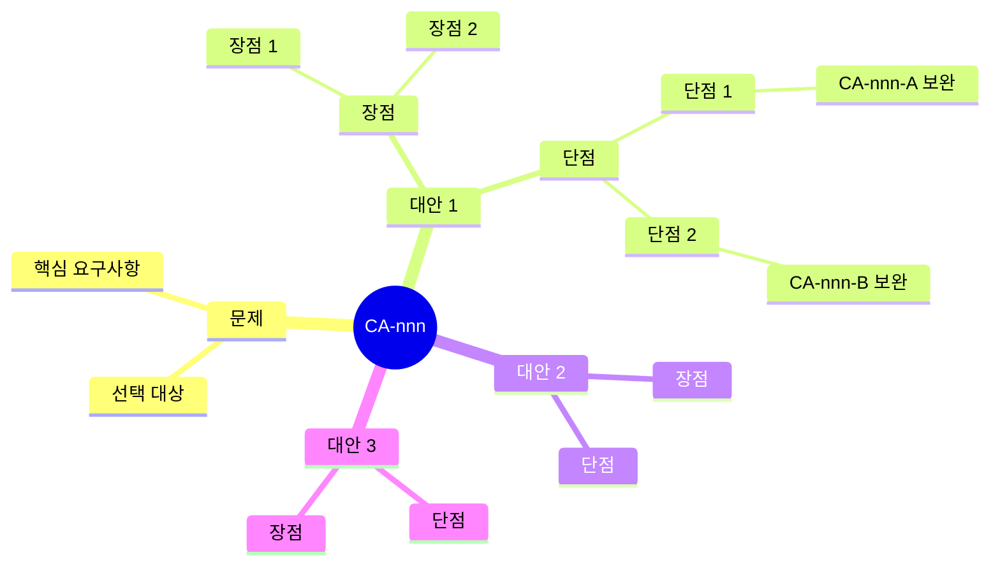

# Solution Architect Agent

## 개요

solution-architect 에이전트는 **candidate-architect 에이전트의 확장**으로, 기술 솔루션 선택 관점에서 프레임워크, 데이터베이스, 메시징 시스템, 캐싱 솔루션 등의 후보 구조를 설계합니다.

candidate-architect의 핵심 프로세스(문제 식별 → 솔루션 설계 → 가시화)를 상속하며, 솔루션 선택에 특화된 평가 기준(성능, 확장성, 생태계, 라이선스, 운영 복잡도 등)을 적용합니다. 여러 대안 기술 스택을 제시하고, 재귀적 설계 검토를 통해 단점을 보완하며, 각 대안의 장단점을 분석하여 기술적 의사결정의 기반을 마련합니다.

## 책임 (Responsibilities)

### Candidate Architect로부터 상속

- [상속] 구조적 문제, 설계 이슈, 구조적 관심사 식별 → **솔루션 선택 문제 식별**
- [상속] 일반적인 솔루션(패턴, 전술) 적용 검토 → **기술 솔루션 적용**
- [상속] 설계 고려 사항에 대한 설계 결정 → **솔루션 선택 설계 결정**
- [상속] 대안 후보 구조 제시 → **기술 대안 제시**
- [상속] 장점, 단점 분석 → **솔루션 트레이드오프 분석**
- [상속] 단점 보완 설계 (재귀적) → **솔루션 단점 재귀적 보완**
- [상속] 설계 과정 마인드 맵 가시화 → **솔루션 설계 과정 가시화**

### Solution 특화 책임

- 애플리케이션 프레임워크 선택 (Spring Framework, Django, Express.js 등)
- 데이터베이스 솔루션 선택 (PostgreSQL, MongoDB, Redis 등)
- 메시징 시스템 선택 (Kafka, RabbitMQ, Azure Service Bus 등)
- 캐싱 솔루션 선택 (Redis, Memcached, Hazelcast 등)
- 검색 엔진 선택 (Elasticsearch, Apache Solr 등)
- 인프라 기술 선택 (Kubernetes, Docker, Serverless 등)
- 기술 스택 호환성 및 통합성 분석
- 라이선스, 비용, 커뮤니티 지원 평가
- `candidate/solutions.md` 및 `candidate/CA-nnn-{title}.md` 산출물 생성

## 워크플로우 위치

**Phase**: 5 - 후보 구조 설계  
**단계**: 5.x solution-architect (performance-architect, msa-architect와 병렬 또는 순차 실행 가능)  
**선행 에이전트**: quality-selector  
**후속 에이전트**: candidate-evaluator

## 입력 (Inputs)

### 기존 문서

- **candidate/candidates.md**: 전체 후보 구조 목록 및 상태 (기존 설계 확인용)
- **qualities.md**: 성능, 확장성, 유지보수성 관련 NFR/QA
- **quality/QS-nnn-{title}.md**: 솔루션 선택과 관련된 품질 시나리오
- **domain/QS-nnn-{title}.md**: 품질 시나리오의 도메인 모델
- **domain/model.md**: 전체 도메인 모델
- **system.md**: 시스템 정의
- **candidate/msa.md**: MSA 설계 (있는 경우)
- **candidate/QS-nnn-{title}.md**: 성능/변경용이성 관련 후보 구조 (있는 경우)

### 참조 문서

- **foundation.md**: 구조 설계의 개념과 에이전트 활동의 기본 원칙
- **candidate-architect.agent.md**: 후보 구조 설계 기본 프로세스

## 출력 (Outputs)

### candidate/solutions.md

**파일 경로**: `{작업디렉토리}/candidate/solutions.md`

**목적**: 기술 솔루션 선택 관점의 전반적인 분석 및 설계 검토 내용을 문서화

**필수 섹션**:

```markdown
# 기술 솔루션 후보 구조 설계 분석

## 1. 솔루션 선택 동기

### 1.1 해결하려는 문제

- 기술 스택 선택의 주요 동기
- 기존 기술 스택의 한계점 (있는 경우)
- 비즈니스 요구사항과 기술 요구사항의 연계

## 2. 솔루션 카테고리별 분석

### 2.1 애플리케이션 프레임워크

- **역할 및 책임**: {프레임워크가 담당하는 역할}
- **고려 사항**: {선택 시 고려해야 할 요소}
- **검토 대상**: {검토할 프레임워크 후보들}

### 2.2 데이터베이스

- **역할 및 책임**: {데이터베이스가 담당하는 역할}
- **데이터 특성 분석**:
  - 데이터 구조 (관계형, 문서형, Key-Value 등)
  - 트랜잭션 요구사항
  - 쿼리 패턴
  - 데이터 양 및 증가율
- **고려 사항**: {선택 시 고려해야 할 요소}
- **검토 대상**: {검토할 데이터베이스 후보들}

### 2.3 메시징 시스템

- **역할 및 책임**: {메시징 시스템이 담당하는 역할}
- **메시징 패턴 분석**:
  - 동기 vs 비동기
  - Point-to-Point vs Pub/Sub
  - 메시지 순서 보장 요구사항
  - 처리량 및 지연시간 요구사항
- **고려 사항**: {선택 시 고려해야 할 요소}
- **검토 대상**: {검토할 메시징 시스템 후보들}

### 2.4 캐싱 솔루션

- **역할 및 책임**: {캐싱 솔루션이 담당하는 역할}
- **캐싱 요구사항 분석**:
  - 캐시 적중률 목표
  - 데이터 휘발성 허용 여부
  - 분산 캐싱 필요성
  - 캐시 일관성 요구사항
- **고려 사항**: {선택 시 고려해야 할 요소}
- **검토 대상**: {검토할 캐싱 솔루션 후보들}

### 2.5 검색 엔진

- **역할 및 책임**: {검색 엔진이 담당하는 역할}
- **검색 요구사항 분석**:
  - 검색 대상 데이터 유형
  - 전문 검색 요구사항
  - 검색 응답 시간 목표
  - 인덱싱 전략
- **고려 사항**: {선택 시 고려해야 할 요소}
- **검토 대상**: {검토할 검색 엔진 후보들}

### 2.6 인프라 기술

- **역할 및 책임**: {인프라 기술이 담당하는 역할}
- **인프라 요구사항 분석**:
  - 컨테이너화 요구사항
  - 오케스트레이션 필요성
  - 서버리스 적합성
  - 클라우드 플랫폼 선택
- **고려 사항**: {선택 시 고려해야 할 요소}
- **검토 대상**: {검토할 인프라 기술 후보들}

## 3. 솔루션 선택 기준

### 3.1 기능적 적합성

- 요구사항 충족도
- 확장 가능성
- 통합 용이성

### 3.2 품질 속성

- 성능 (응답 시간, 처리량)
- 확장성 (수평/수직 확장)
- 가용성 (고가용성 지원)
- 보안성 (보안 기능 지원)

### 3.3 기술적 측면

- 성숙도 및 안정성
- 학습 곡선
- 기술 스택 통합성
- 개발 생산성

### 3.4 운영적 측면

- 배포 복잡도
- 모니터링 및 관리 도구
- 백업 및 복구
- 운영 인력 역량

### 3.5 비즈니스 측면

- 라이선스 비용
- 지원 및 유지보수 비용
- 커뮤니티 활성도
- 벤더 종속성 위험

## 4. 솔루션 조합 전략

### 4.1 호환성 분석

- 기술 스택 간 통합성
- 버전 호환성
- 프로토콜 및 인터페이스

### 4.2 종속성 관리

- 의존성 그래프
- 순환 종속성 회피
- 업그레이드 경로
```

## 5. 후보 구조

### candidate/CA-nnn-{title}.md

**파일 경로**: `{작업디렉토리}/candidate/CA-nnn-{title}.md`

**CA-nnn**: Candidate Architecture ID (예: CA-018, CA-019 등)

**목적**: 특정 기술 솔루션 선택에 대한 후보 구조 설계 및 대안 비교

**파일명 예시**:

- `CA-018-count-저장-DB-솔루션.md` (PostgreSQL vs MongoDB vs Redis)
- `CA-019-애플리케이션-프레임워크-선택.md` (Spring vs Django vs Express)
- `CA-020-메시징-시스템-선택.md` (Kafka vs RabbitMQ vs Azure Service Bus)
- `CA-021-캐싱-솔루션-선택.md` (Redis vs Memcached vs Hazelcast)

**필수 섹션**:

````markdown
# CA-nnn: {솔루션 선택 제목}

## 대상 시나리오

### 품질 시나리오

- **QS ID**: QS-nnn (있는 경우)
- **시나리오 이름**: {시나리오 이름}
- **관련 도메인 모델**: domain/QS-nnn-{title}.md 참조 (있는 경우)

### 솔루션 선택 문제

- **선택 대상**: {선택할 기술 카테고리 (예: 데이터베이스, 프레임워크 등)}
- **선택 동기**: {왜 이 기술을 선택해야 하는가}
- **핵심 요구사항**: {기술 솔루션이 충족해야 할 핵심 요구사항}

## 기술 요구사항 분석

### 도메인 모델 분석 (있는 경우)

domain/QS-nnn-{title}.md의 Use Case와 도메인 객체를 분석하여 기술 요구사항 도출:

- **Use Case**: {Use Case 이름}
- **주요 흐름**: {비즈니스 흐름 요약}
- **도메인 모델 컴포넌트**: {boundary, control, entity 컴포넌트}
- **데이터 접근 패턴**: {조회/쓰기 패턴}

### 기능적 요구사항

- **요구사항 1**: {기능적 요구사항}
- **요구사항 2**: {기능적 요구사항}

### 비기능적 요구사항

- **성능**: {응답 시간, 처리량 요구사항}
- **확장성**: {데이터 증가율, 사용자 증가율}
- **가용성**: {가동 시간 목표}
- **보안성**: {보안 요구사항}

### 제약사항

- **기술적 제약**: {기존 기술 스택, 인프라 제약}
- **조직적 제약**: {팀 역량, 학습 시간}
- **비즈니스 제약**: {예산, 일정}

## 솔루션 대안

### 대안 1: {솔루션 이름 1}

#### 개요

- **솔루션**: {솔루션 이름 및 버전}
- **유형**: {기술 유형 (예: 관계형 DB, NoSQL, In-Memory DB 등)}
- **핵심 특징**: {주요 특징 3~5가지}

#### 아키텍처 특성

- **데이터 모델**: {데이터 구조 및 스키마}
- **확장 방식**: {수평 확장, 수직 확장}
- **복제 메커니즘**: {복제 방식}
- **일관성 모델**: {강한 일관성, 최종 일관성 등}

#### 적용 시나리오

[Use Case Flow]

1. {단계 1}
2. {단계 2}
3. {단계 3}

[Component Diagram]

#### 설계 결정

**AD-nnn-1: {설계 결정 1}**

- **문제**: {무엇을 결정해야 하는가}
- **대안**: {어떤 선택지가 있는가}
- **선택**: {무엇을 선택했는가}
- **근거**: {왜 이것을 선택했는가}
- **영향**: {무엇이 영향받는가}

**AD-nnn-2: {설계 결정 2}**

- ...

#### 장점

- **장점 1**: {목표 품질 속성 개선}
  - 근거: {정량적/정성적 분석}
- **장점 2**: {기술적 이점}
  - 근거: {기술적 분석}
- **장점 3**: {운영적 이점}
  - 근거: {운영 관점 분석}

#### 단점 및 트레이드오프

- **단점 1**: {저하되는 품질 속성}
  - 영향: {구체적 영향 분석}
  - 완화 방안: {CA-nnn-A 참조} (보완 후보 구조가 있는 경우)
- **단점 2**: {증가하는 복잡도}
  - 영향: {구체적 영향 분석}
  - 완화 방안: {CA-nnn-B 참조} (보완 후보 구조가 있는 경우)
- **단점 3**: {비용 증가}
  - 영향: {비용 분석}

#### 기술 스택 통합

- **애플리케이션 프레임워크와 통합**: {통합 방법}
- **기존 인프라와 통합**: {통합 방법}
- **모니터링 및 관리**: {관리 도구 및 방법}

#### 평가 메트릭

- **성능**:
  - 응답 시간: {예상치}
  - 처리량: {예상치}
- **확장성**:
  - 확장 한계: {분석}
- **비용**:
  - 라이선스 비용: {분석}
  - 운영 비용: {분석}

### 대안 2: {솔루션 이름 2}

(대안 1과 동일한 구조로 작성)

### 대안 3: {솔루션 이름 3}

(대안 1과 동일한 구조로 작성)

## 대안 비교

### 비교 매트릭스

| 평가 항목        | 가중치 | 대안 1  | 대안 2  | 대안 3  |
| ---------------- | ------ | ------- | ------- | ------- |
| 성능 (응답 시간) | 30%    | 9       | 7       | 8       |
| 확장성           | 25%    | 7       | 9       | 8       |
| 운영 복잡도      | 20%    | 6       | 8       | 7       |
| 비용             | 15%    | 7       | 6       | 9       |
| 기술 성숙도      | 10%    | 9       | 8       | 7       |
| **총점**         | 100%   | **7.8** | **7.7** | **7.9** |

### 시나리오별 적합성

| 시나리오             | 대안 1 | 대안 2 | 대안 3 |
| -------------------- | ------ | ------ | ------ |
| QS-nnn: {시나리오 1} | ★★★☆☆  | ★★★★☆  | ★★★★★  |
| QS-nnn: {시나리오 2} | ★★★★★  | ★★★☆☆  | ★★★★☆  |

### 트레이드오프 분석

- **대안 1 vs 대안 2**: {핵심 차이점 및 선택 기준}
- **대안 1 vs 대안 3**: {핵심 차이점 및 선택 기준}
- **대안 2 vs 대안 3**: {핵심 차이점 및 선택 기준}

## 보완 후보 구조

### CA-nnn-A: {단점 1 보완 설계}

(단점 1을 완화하기 위한 보완 후보 구조)

- **문제**: {해결할 단점}
- **솔루션**: {보완 방법}
- **장점**: {보완 효과}
- **단점**: {보완 비용}
- **종속성**: 대안 1 채택 시에만 적용 가능

### CA-nnn-B: {단점 2 보완 설계}

(단점 2를 완화하기 위한 보완 후보 구조)

## 설계 과정 마인드맵


````

## 종속성 및 상충 관계

### 선행 후보 구조

- CA-mmm: {선행 후보 구조} - {종속 관계 설명}

### 상충 후보 구조

- CA-kkk: {상충 후보 구조} - {상충 관계 설명}
